# 🌙 Islami

**Islami** is a user-friendly Flutter app that helps you explore the Holy Quran, Hadith, daily Azkar, prayer times, and Islamic radio channels, all in one place. Perfect for anyone looking to strengthen their Islamic knowledge and daily practice. 📖✨

---

## 🚀 Features

- **Splash Screen & Home Tab**  
  - Displays all **114 Surahs** of the Quran  
  - Search Surahs by name 🔍  
  - Recent section shows the last **6 Surahs** viewed

- **Surah Details Screen**  
  - View Surah content in **two different layouts**  
  - Switch between layouts easily 🔄

- **Hadith Screen**  
  - Browse multiple Hadiths using a **slider** 📜  
  - Each Hadith shows a **partial preview**, tap to view the **full content** on a separate screen

- **Tasbeeh Screen**  
  - Count each Zikr up to **33**  
  - Automatically moves to the next Dhikr after 33 🔢

- **Radio Screen**  
  - List of audio players, each playing a different **Islamic radio channel** 🎧

- **Time Tab**  
  - **Prayer times** + Hijri & Gregorian date (fetched from API) ⏰  
  - Daily **Azkar** (Morning, Evening, Wake up, Sleep) loaded locally  

---

## 📸 Screenshots

> Replace the URLs with your actual screenshots in your repository

  
  
  
  
  
  
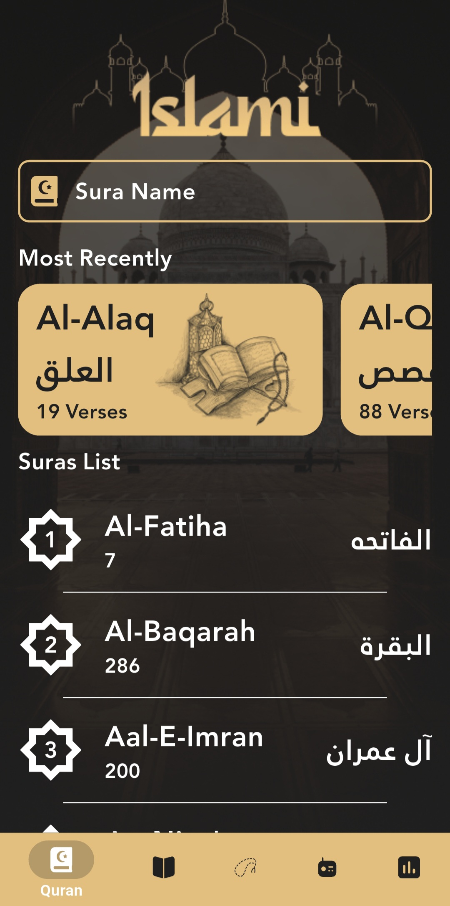  
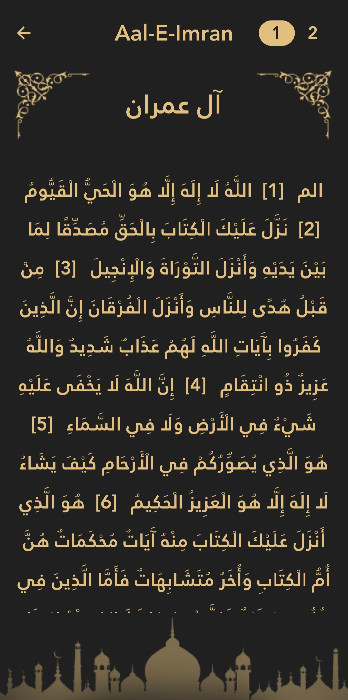  
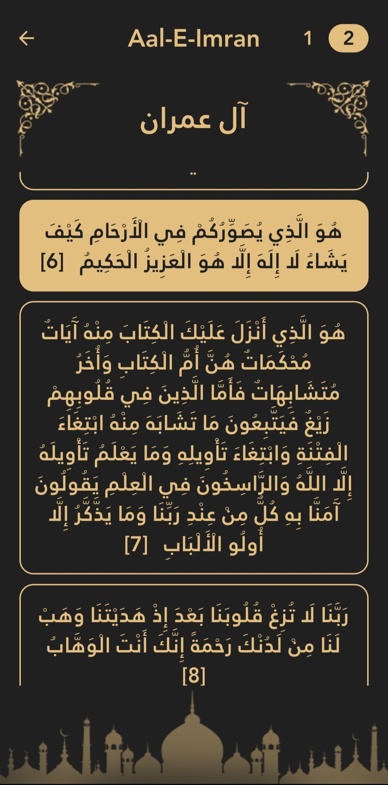  
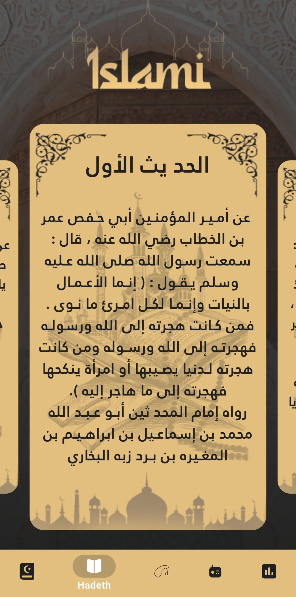  
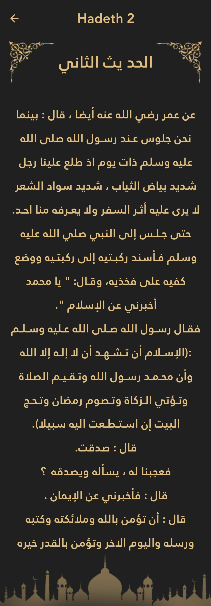  
  
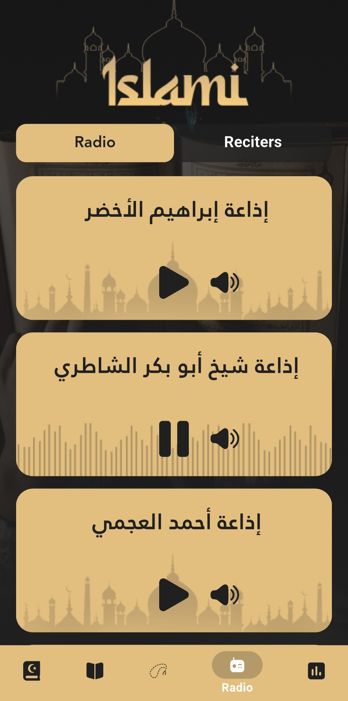  
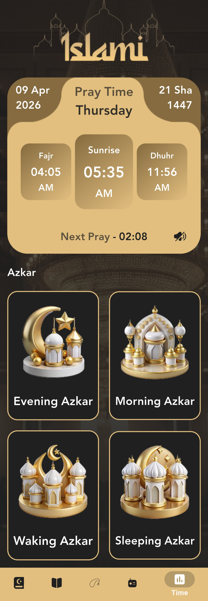  
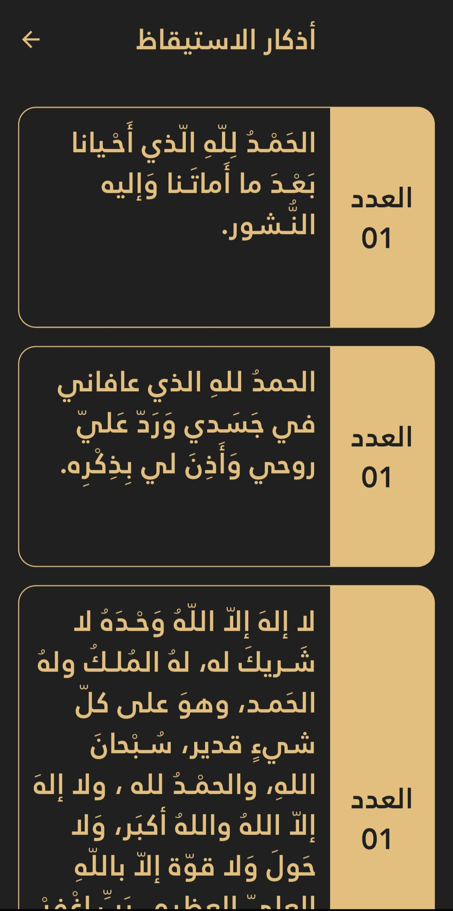  
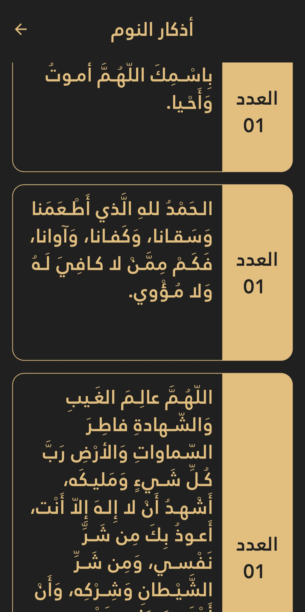  
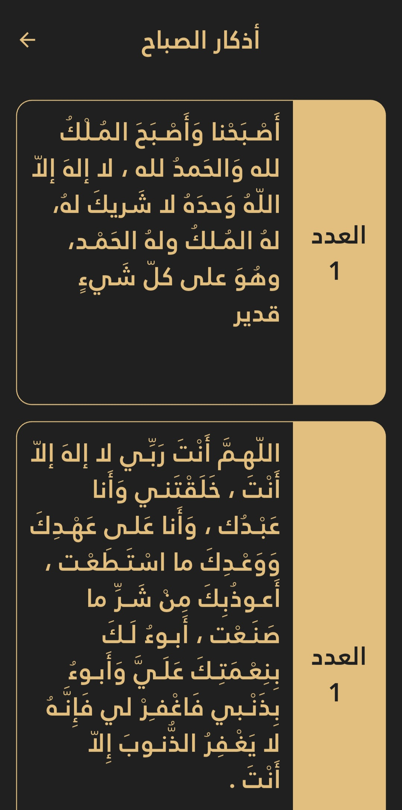  
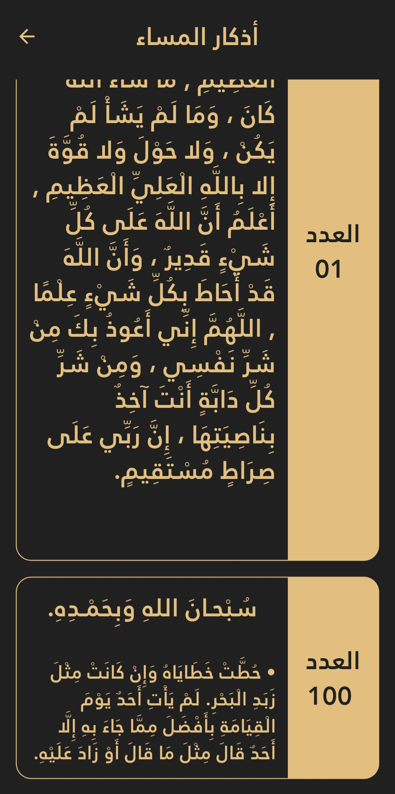  


---

## 📦 Packages Used

- `flutter_native_splash: ^2.4.7`  
- `introduction_screen: ^4.0.0`  
- `flutter_svg: ^2.2.3`  
- `shared_preferences: ^2.5.4`  
- `carousel_slider: ^5.1.1`  
- `provider: ^6.1.5+1`  
- `http: ^1.6.0`  
- `intl: ^0.20.2`  
- `just_audio: ^0.10.5`  
- `flutter_launcher_icons: ^0.14.4`  
- `rename: ^3.1.0`  

---

## 🛠 Installation & Run

Clone the repository, install dependencies, and run the app:

```bash
git clone https://github.com/abdallahelnshar123-ux/Islami.git
cd Islami
flutter pub get
flutter run
```

## 👨‍💻 Author & License

**Abdallah Samir Elnshar**

This app is part of a series of projects developed during my journey at **Route Academy**.  
Thank you for checking out my work! 🙏

This project is open source and available under the **MIT License**.  
